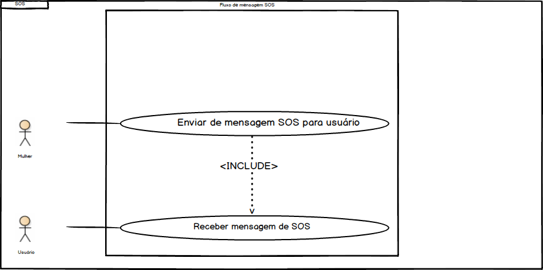

# Casos de uso

## 1. Diagrama de casos de uso

**Instruções do professor**: Insira abaixo o diagrama com os casos de uso do seu sistema. A imagem abaixo é somente um exemplo.

## 2. Especificação dos casos de uso

**Instruções do professor**: Para cada caso de uso, criar as tabelas com a especificação do caso de uso. Siga o exemplo dado abaixo:

### 2.1. Caso de uso **BUSCAR DELEGACIAS PRÓXIMAS**

| Campo          | Informação        |
|---|---|
| Identificador: | UC01              |
| Nome:          | Buscar delegacias |
| Atores:        | Interessado em saber localização das delegacias  |
| Sumário:       | Busca delegacias próximas de sua localização |

| Fluxo Principal |
|---|
| 1) Usuário clica na opção de buscar delegacias. |
| 2) O sistema recupera as informações de localização através da API do Google.               |
| 3) Usuário aplica os filtros necessários, se deseja as delegacias comuns, somente para mulheres ou todas.|
| 4) O sistema apresenta as delegacias de acordo com o filtro mais próximas de seu localização. |

| Fluxo Alternativo (2a): O sistema não encontra a localização. |
|---|
| 1) O sistema informa que não conseguiu recuperar as informações de localização. |
| 2) Sistema informa que talvez o usuario tenha que permitir ao site que obtenha sua localização. |
| 3) Usuário checa se a opção está ativada. |
| 4) Volta ao passo (2) do fluxo principal. |

### 2.2. Caso de uso **ENVIAR MENSAGEM SOS**

| Campo          | Informação        |
|---|---|
| Identificador: | UC02              |
| Nome:          | Enviar mensagem SOS |
| Atores:        | Vitima do ataque  |
| Sumário:       | Envia email de socorro |

| Fluxo Principal |
|---|
| 1) Usuário clica na opção de enviar mensagem de socorro. |
| 2) O sistema apresenta um formulário com as informações a serem preenchidas.        |
| 3) Usuário preenche os campos com suas informações e o email de quem quer que recebe a mensagem.|
| 4) O sistema envia a mensagem de socorro ao contato e apresenta uma mensagem de concluido com sucesso. |

| Fluxo Alternativo (2a): O sistema não consegue enviar o email. |
|---|
| 1) O sistema informa que não conseguiu enviar o email. |
| 2) Sistema informa que talvez o email do destinatário esteja incorreto. |
| 3) Usuário checa se o email está correto. |
| 4) Volta ao passo (2) do fluxo principal. |

### 2.3. Caso de uso **Ver Newsletter**

| Campo          | Informação        |
|---|---|
| Identificador: | UC03              |
| Nome:          | Ver Newsletter |
| Atores:        | Interessados em ler as ultimas noticias sobre segurança da Mulher  |
| Sumário:       | Busca notícias que podem interessar às mulheres em relação a segurança |

| Fluxo Principal |
|---|
| 1) Usuário clica em "Home". |
| 2) O sistema apresenta em forma de newsletter, as últimas noticias sobre segurança da Mulher.        |
| 3) Usuário seleciona a notícia que deseja ler.|
| 4) O sistema apresenta mais detalhes sobre a notícia. |

### 2.4. Caso de uso **Fazer Cadastro**

| Campo          | Informação        |
|---|---|
| Identificador: | UC03              |
| Nome:          | Fazer Cadastro |
| Atores:        | Interessados em usufruir do serviço do Botão de Emergência para pedir ajuda e enviar mensagens para contatos cadastrados|
| Sumário:       | Realiza o cadastro do usuário |

| Fluxo Principal |
|---|
| 1) Usuário clica no ícone localizado no canto superior direito da tela. |
| 2) Se não estiver numa conta ou logado, o usuário preenche o campo "Email" e "CPF" e depois clicar em "Cadastrar". |
| 3) O usuário preenche o campo "Nome", "Data de Nascimento", "Telefone", "Email de emergencia" e "Telefone de emergencia". |
| 4) O usuário clica em "Cadastrar". |
| 5) O sistema apresenta que o cadastro foi realizado com sucesso. |

### 2.5. Caso de uso **Gestão de Cadastro**

| Campo          | Informação        |
|---|---|
| Identificador: | UC03              |
| Nome:          | Gestão de Cadastro |
| Atores:        | Interessados em editar o cadastro|
| Sumário:       | Realiza o gestão do cadastro |

| Fluxo Principal |
|---|
| 1) Usuário clica em no ícone do canto superior direito. |
| 2) O sistema apresenta a tela dos dados já cadastrados. |
| 3) O usuário clica no ícone semelhante a uma caneta. |
| 4) O usuário pode preencher o campo "Nome", "Data de Nascimento", "Telefone", "Email de emergencia" ou "Telefone de emergencia". |
| 5) O sistema apresenta que a atualização foi realizada com sucesso. |

| Fluxo Alternativo (2.5a): O sistema não encontrou o usuário logado. |
|---|
| 1) O sistema informa a tela de "Login" e de "Cadastro". |
| 2) O usuáro preenche o campo "Email" e "Senha". |
| 3) O Usuário clica em "Entrar". |
| 4) Volta ao passo (2.5) do fluxo principal. |

**Instruções do professor**: As tabelas acima mostram um exemplo de especificação de **um único caso de uso**. Lembre-se de especificar cada um dos casos de uso.

